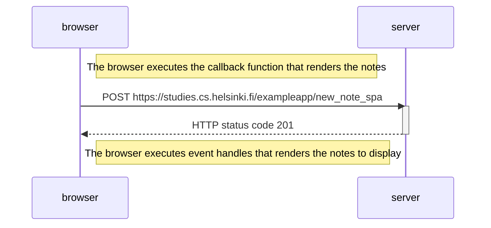

## Assignment 0.6

```mermaid
sequenceDiagram
    participant browser
    participant server

    Note right of browser: The browser executes the callback function that renders the notes
    browser->>server: POST https://studies.cs.helsinki.fi/exampleapp/new_note_spa
    activate server
    server-->>browser: HTTP status code 201
    deactivate server
    
    Note right of browser: The browser executes event handles that renders the notes to display

```